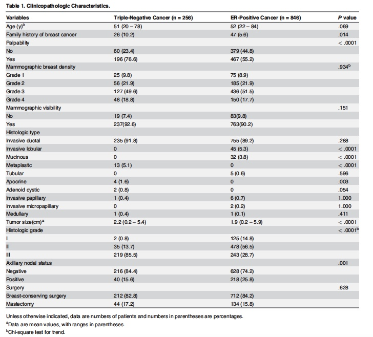
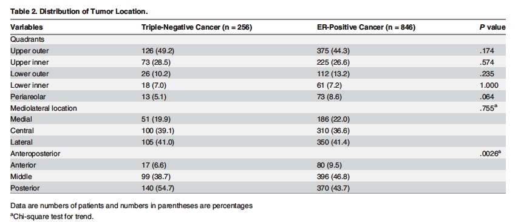
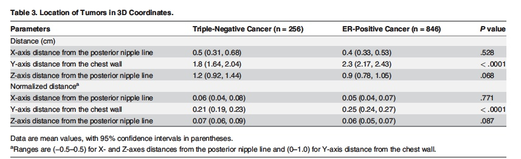
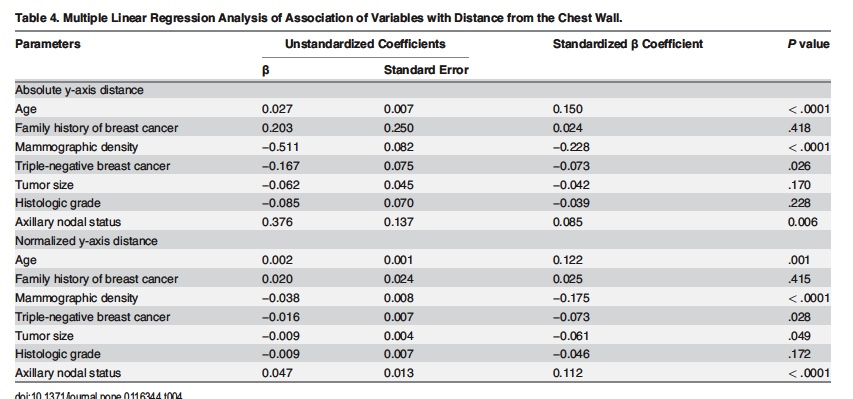

```{r setup, include=FALSE}
library(dplyr)
library(tidyverse)
library(knitr)
# These are some {knitr} options I typically use to format my 
# ***RMarkdown*** documents in a consistent way
# You should feel free to alter these or use other "chunk options" as
# you see fit!
# Sometimes, for example, you might want to suppress warnings or
# messages, and that behavior can be set for specific code chunks in
# the chunk header, e.g., ```{r warning = FALSE, echo = FALSE}
knitr::opts_chunk$set(
  eval = TRUE, # run code in code chunks
  echo = TRUE, # render output of code chunks
  warning = TRUE, # do not suppress "warnings"
  message = TRUE, # do not suppress "messages"
  comment = "##", # prefix for comment lines
  prompt = ">", # prefix for code lines
  tidy = TRUE,
  tidy.opts = list(blank = FALSE, width.cutoff = 75),
  fig.path = "Kim et_al_photos/", # name of folder for images
  fig.align = "center" # centers any images on the page
)
```


```{r setup}
#Loading in the dataset 
library(dplyr)
library(tidyverse)
library(knitr)
f <- "https://raw.githubusercontent.com/mrpickett26/Individual-Data-Analysis-Replication/main/tumor%20location%20raw%20data_final.csv"
d <- read_csv(f, col_names = TRUE)
head(d)
library(skimr)
skim(d) #getting some quick stats before filtering... based on raw data a lot of filtering needs to occur but useful for a couple variables
knitr::opts_chunk$set(fig.path = "Kim_et_al_photos/")

# DESCRIPTIVE STATISTICS

##Want to separate data out into the two different subtypes (ER and Triple Negative), key factor in the paper. In this section I focus on the Triple Negative subtype. From this filtered dataset, I create variables for the number (counts) of each histological grade as well as the percentage of each histological grade within the population. I wrote a function that included n in it because later on, I will have to filter out some of the NAs that are in the raw dataset and this made it easier. 
Triple_neg<-filter(d, Subtype=="3")
n<- nrow(Triple_neg)

T_Hist_grade_1<-(length(which(Triple_neg$Histologic_full=="1")))
T_hist_grade_2<-(length(which(Triple_neg$Histologic_full=="2")))
T_hist_grade_3<-(length(which(Triple_neg$Histologic_full=="3")))
percent<- function(x){
  perc<- x/256
  return(perc)
}
T_hist_grade1_percent<- percent(T_Hist_grade_1)
T_hist_grade2_percent<- percent(T_hist_grade_2)
T_hist_grade3_percent<- percent(T_hist_grade_3)

## T_Hist_grade tells the number of patients whose identified cancers belong to each type. 

## Here I replace the #NULL! with NA so that I can filter it out into a new dataframe. I then convert it into a numeric so that it can be passed through the built in mean function.

ans <- Triple_neg %>% replace(.=="#NULL!", NA) 
g<-ans[!is.na(ans$Size_Pathol_cm_),]
Mean_Size_T<-as.numeric(g$Size_Pathol_cm_)
Mean_size_Trip_neg<-mean(Mean_Size_T) 
Mean_size_Trip_neg
## After finding the  mean of the size of the triple negative tumor in cm after omitting all #NULL! values, I think the data set in the paper  maybe replaced the Null values  with 0  or used the n of 256 to calculate the mean because my mean is slightly higher
Range_size_trip_neg<- range(Mean_Size_T)
Range_size_trip_neg
#find the range of values for the tumor size. The paper says that the range of the values for tumor size are (0.2-5.4), whereas my calculations indicate that the range extends up to 9.3. 

#Palpability
Triple_neg$Palpability[Triple_neg$Palpability=="1"]<-"No"
Triple_neg$Palpability[Triple_neg$Palpability=="0"]<-"Yes"
##Changed the 1 and 0s found in Palpability to Yes and No values, and now count the number of yes and no values 
No<-(length(which(Triple_neg$Palpability=="No")))
Yes<-(length(which(Triple_neg$Palpability=="Yes")))
Percent_palp<- percent(Yes)
Percent_not_palp<-percent(No)
##Calculated the number and percentage of palpable vs not palpable tumors in the Triple Negative subtype, using the function as defined above. I thought it was easiest to assign them into new variable in order to format them into the table properly.

##Now I will assign the numeric positional data to new values which will make it easier to filter out the data and do further analyses, again I thought variable assignment was the best for later calculations.
UOQ<-(length(which(Triple_neg$Qudrants2_1_UOQ_2_UIQ_3_LOQ_4_LIQ_5_periareolar_6___overlapping=="1")))
percent_UOQ<-percent(UOQ)
UIQ<-(length(which(Triple_neg$Qudrants2_1_UOQ_2_UIQ_3_LOQ_4_LIQ_5_periareolar_6___overlapping=="2")))
percent_UIQ<-percent(UIQ)
LOQ<-(length(which(Triple_neg$Qudrants2_1_UOQ_2_UIQ_3_LOQ_4_LIQ_5_periareolar_6___overlapping=="3")))
percent_LOQ<-percent(LOQ)
LIQ<-(length(which(Triple_neg$Qudrants2_1_UOQ_2_UIQ_3_LOQ_4_LIQ_5_periareolar_6___overlapping=="4")))
percent_LIQ<-percent(LIQ)
periareolar<-(length(which(Triple_neg$Qudrants2_1_UOQ_2_UIQ_3_LOQ_4_LIQ_5_periareolar_6___overlapping=="5")))
percent_periareolar<-percent(periareolar)

##Doing the assignments for mediolateral locations
medial<-(length(which(Triple_neg$MR_Location_ML__1__medial_2__central_3__lateral_=="1")))
percent_medial<-percent(medial)
central<-(length(which(Triple_neg$MR_Location_ML__1__medial_2__central_3__lateral_=="2")))
percent_central<-percent(central)
lateral<-(length(which(Triple_neg$MR_Location_ML__1__medial_2__central_3__lateral_=="3")))
percent_lateral<-percent(lateral)

##Doing the same assignments for anteroposterior locations
anterior<-(length(which(Triple_neg$MR_Location_AP__1__anterior_2__middle_3__posterior_=="1")))
percent_anterior<-percent(anterior)
middle<-(length(which(Triple_neg$MR_Location_AP__1__anterior_2__middle_3__posterior_=="2")))
percent_middle<-percent(middle)
posterior<-(length(which(Triple_neg$MR_Location_AP__1__anterior_2__middle_3__posterior_=="3")))
percent_posterior<-percent(posterior)

## Now I will filter the data for ER and conduct descriptive stats on it 
ER_pos<-filter(d, Subtype=="1")
n_E<- nrow(ER_pos)

##Histological Grade filtering, and wrote a new function for percent to account for the change in n. 
T_Hist_grade_1_E<-(length(which(ER_pos$Histologic_full=="1")))
T_hist_grade_2_E<-(length(which(ER_pos$Histologic_full=="2")))
T_hist_grade_3_E<-(length(which(ER_pos$Histologic_full=="3")))
percentE<- function(x){
  perc<- x/846
  return(perc)
}
T_hist_grade1E_percent<- percentE(T_Hist_grade_1_E)
T_hist_grade2E_percent<- percentE(T_hist_grade_2_E)
T_hist_grade3E_percent<- percentE(T_hist_grade_3_E)

##In this, much like in the TN case, I replaced the NULL values with NA to remove them from the dataframe to make for easier wrangling.
ans <- ER_pos %>% replace(.=="#NULL!", NA) 
Eg<-ans[!is.na(ans$Size_Pathol_cm_),]
Mean_Size_E<-as.numeric(Eg$Size_Pathol_cm_)
Mean_size_ER<-mean(Mean_Size_E)
Mean_size_ER

Range_size_ER<- range(Eg$Size_Pathol_cm_)
Range_size_ER
## Again, the values I got for both the range and mean of the subtype differ from what is reported. Could be attributed to replacement with zeros or averaging with filtered data. Unsure why the range is different than reported.... The filtering was done correctly. 

## Now ran the statistics for the palpability of ER data. 
No_ER<-(length(which(ER_pos$Palpability=="1")))
Yes_ER<-(length(which(ER_pos$Palpability=="0")))
Percent_palpE<- percentE(Yes_ER)
Percent_not_palpE<-percentE(No_ER)

## Now filter out the ER data based on each quadrant and assign variables to each to put into a table. Calculate the percentages as well based on the function that I wrote previously. 
UOQ_E<-(length(which(ER_pos$Qudrants2_1_UOQ_2_UIQ_3_LOQ_4_LIQ_5_periareolar_6___overlapping=="1")))
percent_UOQ_E<-percentE(UOQ_E)
UIQ_E<-(length(which(ER_pos$Qudrants2_1_UOQ_2_UIQ_3_LOQ_4_LIQ_5_periareolar_6___overlapping=="2")))
percent_UIQ_E<-percent(UIQ_E)
LOQ_E<-(length(which(ER_pos$Qudrants2_1_UOQ_2_UIQ_3_LOQ_4_LIQ_5_periareolar_6___overlapping=="3")))
percent_LOQ_E<-percentE(LOQ_E)
LIQ_E<-(length(which(ER_pos$Qudrants2_1_UOQ_2_UIQ_3_LOQ_4_LIQ_5_periareolar_6___overlapping=="4")))
percent_LIQ_E<-percentE(LIQ_E)
periareolar_E<-(length(which(ER_pos$Qudrants2_1_UOQ_2_UIQ_3_LOQ_4_LIQ_5_periareolar_6___overlapping=="5")))
percent_periareolar_E<-percentE(periareolar_E)

## Do the same for mediolateral locations. Assign valulations to  variables to be put in a table. 
medial_E<-(length(which(ER_pos$MR_Location_ML__1__medial_2__central_3__lateral_=="1")))
percent_medial_E<-percentE(medial_E)
central_E<-(length(which(ER_pos$MR_Location_ML__1__medial_2__central_3__lateral_=="2")))
percent_central_E<-percentE(central_E)
lateral_E<-(length(which(ER_pos$MR_Location_ML__1__medial_2__central_3__lateral_=="3")))
percent_lateral_E<-percent(lateral_E)

#ER now do the same assignments for anteroposterior locations
anterior_E<-(length(which(ER_pos$MR_Location_AP__1__anterior_2__middle_3__posterior_=="1")))
percent_anterior_E<-percentE(anterior_E)
middle_E<-(length(which(ER_pos$MR_Location_AP__1__anterior_2__middle_3__posterior_=="2")))
percent_middle_E<-percentE(middle_E)
posterior_E<-(length(which(ER_pos$MR_Location_AP__1__anterior_2__middle_3__posterior_=="3")))
percent_posterior_E<-percentE(posterior_E)

#Make variables into a table that matches the one in the paper.

a<-c("Palpability_no","Palpability_yes", "Upper Outer Quadrant","Upper Inner Quadrant","Lower Outer Quadrant","Lower Inner Quadrant", "Periareolar", "Mediolateral_Medial", "Mediolateral_Central", "Mediolateral_Lateral", "Anteroposterior_Anterior", "Anteroposterior_Middle", "Anteroposterior_Posterior","Histological Grade 1","Histological Grade 2","Histological Grade 3")
b<-c(Yes, No, UOQ, UIQ, LOQ, LIQ, periareolar, medial, central, lateral, anterior, middle, posterior, T_Hist_grade_1, T_hist_grade_2, T_hist_grade_3)
c<- 100* c(Percent_palp, Percent_not_palp, percent_UOQ, percent_UIQ, percent_LOQ, percent_LIQ, percent_periareolar, percent_medial, percent_central, percent_lateral, percent_anterior, percent_middle, percent_posterior, T_hist_grade1_percent, T_hist_grade2_percent, T_hist_grade3_percent)
d<-c(Yes_ER, No_ER, UOQ_E, UIQ_E, LOQ_E, LIQ_E, periareolar_E, medial_E, central_E, lateral_E, anterior_E, middle_E, posterior_E, T_Hist_grade_1_E, T_hist_grade_2_E, T_hist_grade_3_E)
e<- 100* c(Percent_palpE, Percent_not_palpE, percent_UOQ_E, percent_UIQ_E, percent_LOQ_E, percent_LIQ_E, percent_periareolar_E, percent_medial_E, percent_central_E, percent_lateral_E, percent_anterior_E, percent_middle_E, percent_posterior_E, T_hist_grade1E_percent, T_hist_grade2E_percent, T_hist_grade3E_percent)
bind_col<-data.frame(Variables=a, Triple_Negative_Counts=b, Triple_Negative_Percentages=c, ER_Counts=d, ER_Percentages=e)

library(kableExtra)

kable(bind_col, digits = 3) %>%
  kable_styling(font_size = 12, full_width = FALSE)
bind_col



```

```{r setup}


#More Descriptive Stats

## Need to filter out the normalized distance from the chest wall and distance from the chest wall, need to relplace the NULL with NA in order to have a tidy dataset that I can use for future calculations. I decided to filter all of the positional data, so that I could use it for visualization in the next step. 

Triple_neg_normY <- Triple_neg$Y_normalized%>%
  replace(.=="#NULL!", NA) 
Triple_neg_normY<- na.omit(Triple_neg_normY)
m_Triple_neg_normY<- mean(Triple_neg_normY)

Triple_neg_normX <- Triple_neg$X_normalized%>%
  replace(.=="#NULL!", NA) 
Triple_neg_normX<- na.omit(Triple_neg_normX)
m_Triple_neg_normX<- mean(Triple_neg_normX)

Triple_neg_normZ <- Triple_neg$Z_normalized%>%
  replace(.=="#NULL!", NA) 
Triple_neg_normZ<- na.omit(Triple_neg_normZ)
m_Triple_neg_normZ<- mean(Triple_neg_normZ)

Triple_neg_Y <- Triple_neg$Y_distance%>%
  replace(.=="#NULL!", NA) 
Triple_neg_Y<- na.omit(Triple_neg_Y)
m_Triple_neg_Y<- mean(Triple_neg_Y)

Triple_neg_X <- Triple_neg$X_distance%>%
  replace(.=="#NULL!", NA) 
Triple_neg_X<- na.omit(Triple_neg_X)
m_Triple_neg_X<- mean(Triple_neg_X)

Triple_neg_Z <- Triple_neg$Z_distance%>%
  replace(.=="#NULL!", NA) 
Triple_neg_Z<- na.omit(Triple_neg_Z)
m_Triple_neg_Z<- mean(Triple_neg_Z)

## Do the same positional filtering for ER data. 
ER_normY <- ER_pos$Y_normalized%>%
  replace(.=="#NULL!", NA) 
ER_normY<- na.omit(ER_normY)
m_ER_normY<- mean(ER_normY)

ER_normX <- ER_pos$X_normalized%>%
  replace(.=="#NULL!", NA) 
ER_normX<- na.omit(ER_normX)
m_ER_normX<- mean(ER_normX)

ER_normZ <- ER_pos$Z_normalized%>%
  replace(.=="#NULL!", NA) 
ER_normZ<- na.omit(ER_normZ)
m_ER_normZ<- mean(ER_normZ)

ER_Y <- ER_pos$Y_distance%>%
  replace(.=="#NULL!", NA) 
ER_Y<- na.omit(ER_Y)
m_ER_Y<- mean(ER_Y)

ER_X <- ER_pos$X_distance%>%
  replace(.=="#NULL!", NA) 
ER_X<- na.omit(ER_X)
m_ER_X<- mean(ER_X)

ER_Z <- ER_pos$Z_distance%>%
  replace(.=="#NULL!", NA) 
ER_Z<- na.omit(ER_Z)
m_ER_Z<- mean(ER_Z)

## Begin doing inferential stats, assume normal distribution for standard error and confidence intervals. I created a function for both of them and will use it to define variables in the future. 
SE <- function(x, type="normal") {
  if (type=="normal"){
    SE <- sd(x)/sqrt(length(x))
  }
  if (type=="poisson"){
    SE <- sqrt(mean(x)/length(x))
    # mean(x) is estimate of lambda
  }
  return(SE)
}

CI_norm <- function(x, alpha = 0.05) {
  CI <- mean(x) + c(-1,1) * qnorm(1 - alpha/2) * SE(x)
  # confidence interval based on normal distribution
  names(CI) <- c("CI norm L","CI norm U")
  return(CI)
}

## Now take the data and filter it by positional filters and pass through the functions needed to get the variables of interest for the summary table that will later be created. 
ER_means <- ER_pos %>% dplyr::summarise(across(
  .cols = c(Y_distance, X_distance, Z_distance, Y_normalized, X_normalized, Z_normalized),
.fns = ~ mean(.)))

ER_SD <- ER_pos %>% dplyr::summarise(across(
  .cols = c(Y_distance, X_distance, Z_distance, Y_normalized, X_normalized, Z_normalized),
.fns = ~ sd(.)))

ER_SEs <- ER_pos %>% dplyr::summarise(across(
    .cols = c(Y_distance, X_distance, Z_distance, Y_normalized, X_normalized, Z_normalized),
.fns = ~ SE(., type = "normal")))

ER_CI_norm <- ER_pos %>%
dplyr::summarise(across(
  .cols = c(Y_distance, X_distance, Z_distance, Y_normalized, X_normalized, Z_normalized),
  .fns = ~ CI_norm(.)))

TN_means <- Triple_neg %>% dplyr::summarise(across(
  .cols = c(Y_distance, X_distance, Z_distance, Y_normalized, X_normalized, Z_normalized),
.fns = ~ mean(.)))

TN_SD <- Triple_neg %>% dplyr::summarise(across(
  .cols = c(Y_distance, X_distance, Z_distance, Y_normalized, X_normalized, Z_normalized),
.fns = ~ sd(.)))

TN_SEs <- Triple_neg %>% dplyr::summarise(across(
    .cols = c(Y_distance, X_distance, Z_distance, Y_normalized, X_normalized, Z_normalized),
.fns = ~ SE(., type = "normal")))

TN_CI_norm <- Triple_neg %>%
dplyr::summarise(across(
  .cols = c(Y_distance, X_distance, Z_distance, Y_normalized, X_normalized, Z_normalized),
  .fns = ~ CI_norm(.)))

## Not perform t-tests on on the variables/filtered data in order to extract the p-values needed for the tables. 
library(lsr)
X_norm<-t.test(ER_normX, Triple_neg_normX)
p_x_norm<- X_norm$p.value

Y_norm<-t.test(ER_normY, Triple_neg_normY)
p_y_norm<- Y_norm$p.value

Z_norm<-t.test(ER_normZ, Triple_neg_normZ)
p_Z_norm<- Z_norm$p.value

Z_dist<-t.test(ER_Z, Triple_neg_Z)
p_Z<- Z_dist$p.value

x_dist<-t.test(ER_X, Triple_neg_X)
p_x<- x_dist$p.value

y_dist<-t.test(ER_Y, Triple_neg_Y)
p_y<- y_dist$p.value

##Create the second descriptive table found in the paper
samp_1_summary <- as_tibble(t(bind_rows(ER_means, TN_means, ER_SD, TN_SD, ER_SEs, TN_SEs, ER_CI_norm, TN_CI_norm)), .name_repair = "minimal")
names(samp_1_summary) <- c(" ER Mean", "TN Mean", "ER SD", "TN SD", "ER Std Error", "TN Std Error", "ER Confidence Interval L", "ER Confidence Interval U", "TN Confidence Interval L", "TN Confidence Interval U")
variables <- tibble(Variable = c("Y_distance", "X_distance", "Z_distance", "Y_normalized", "X_normalized", "Z_normalized"))
library(kableExtra)
samp_summary <- bind_cols(variables, samp_1_summary)

kable(samp_1_summary, digits = 3) %>%
  kable_styling(font_size = 12, full_width = FALSE)
samp_summary


```

```{r setup}
# Inferential Stats
#Do inferential stats for the paper, no distinction between TN and ER for calculations for the beta coefficients
## Reading in the data again because so mamy variables were defined before that it is just simpler for my brain to refilter based off of what is needed from the total dataset
library(dplyr)
library(tidyverse)
f <- "https://raw.githubusercontent.com/mrpickett26/Individual-Data-Analysis-Replication/main/tumor%20location%20raw%20data_final.csv"
d <- read_csv(f, col_names = TRUE)

ans2 <- d%>% replace(.=="#NULL!", NA) 
ans2<- na.omit(ans2)

## Redefine variables from the filtered dataset and convert them to numeric so that I can do further calculations on them more easily 
Size_pathol<- as.numeric(ans2$Size_Pathol_cm_)
Hist_grade<- as.numeric(ans2$Histologic_full)
Subtype<- as.numeric(ans2$Subtype)

## Define the absolute and normalized y distances as numeric variable for use in later calculations
normY_d <- ans2$Y_normalized ## normalized

Y_d <- ans2$Y_distance ##Absolute

## Hand calculate the beta coefficients of normalized y-axis and tumor size before doing any of the built in calculations.
beta1_size<- cor(normY_d, Size_pathol)*(sd(normY_d)/sd(Size_pathol))
beta1_size


(beta0_size <- mean(normY_d) - beta1_size * mean(Size_pathol))
beta0_size #do hand calculations of beta0 for normalized y distance am size of tumor

##Now do standard error of b1 and b0 for normalized y distance am size of tumor by hand 
n <- nrow(ans2)
df<-n-2
mean_x <- mean(Size_pathol)
y_pred = beta0_size + beta1_size*normY_d
y_error = normY_d - y_pred
std_err_b1_dist <- sqrt((sum(y_error^2))/((n-2)*sum((Size_pathol-mean_x)^2)))
std_err_b1_dist
##I will use the lm function to evaluate the rest of the variables BUT if I was to do it by hand, it would follow the formats about for beta1_size, beta1_size_norm, beta0_size, and beta0_size_norm

##Now utilize the lm function to double check calculations and calculate the beta coefficients of absolute/normalized against selected variables (subtype, size, histological grade). I chose subtype because it is foundational to the paper, size becuase the data is continuous, and histological grade because it was good for me to practice categorical data analysis and it was in a relatively clean format.  
m_size_path_norm<-lm(normY_d~Size_pathol, data=ans2)
summary(m_size_path_norm)
std_err_pn<-coef(summary(m_size_path_norm))[, "Std. Error"]

m_Hist_grade_norm<-lm(normY_d~Hist_grade, data=ans2)
summary(m_Hist_grade_norm) #This one seems to differ 
std_err_hgn<-coef(summary(m_Hist_grade_norm))[, "Std. Error"]

m_Subtype_norm<-lm(normY_d~Subtype, data=ans2)
summary(m_Subtype_norm)
std_err_sn<-coef(summary(m_Subtype_norm))[, "Std. Error"]

m_size_path<-lm(Y_d~Size_pathol, data=ans2)
summary(m_size_path)
std_err_sp<-coef(summary(m_size_path))[, "Std. Error"]

m_Hist_grade<-lm(Y_d~Hist_grade, data=ans2)
summary(m_Hist_grade) #This one seems to differ 
std_err_hg<-coef(summary(m_Hist_grade))[, "Std. Error"]

m_Subtype<-lm(Y_d~Subtype, data=ans2)
summary(m_Subtype)
std_err_s<-coef(summary(m_Subtype))[, "Std. Error"]

#"In statistics, standardized (regression) coefficients, also called beta coefficients or beta weights, are the estimates resulting from a regression analysis where the underlying data have been standardized so that the variances of dependent and independent variables are equal to 1." source: https://en.wikipedia.org/wiki/Standardized_coefficient, the lm.beta package allows us to calculate this easily, and will be done for the previously used variables. 

library(lm.beta) 
Std_beta_coeff_Y_norm_size<-lm.beta(m_size_path_norm)
summary(Std_beta_coeff_Y_norm_size)
coeff_size_norm<- Std_beta_coeff_Y_norm_size$coefficients
std_coeff_size_norm<- Std_beta_coeff_Y_norm_size$standardized.coefficients

Std_beta_coeff_Y_size<-lm.beta(m_size_path)
summary(Std_beta_coeff_Y_size)
coeff_size<- Std_beta_coeff_Y_size$coefficients
std_coeff_size<- Std_beta_coeff_Y_size$standardized.coefficients

std_beta_hist_norm<- lm.beta(m_Hist_grade_norm)
summary(std_beta_hist_norm)
coeff_hist_norm<- std_beta_hist_norm$coefficients
std_coeff_hist_norm<- std_beta_hist_norm$standardized.coefficients

std_beta_hist<-lm.beta(m_Hist_grade)
summary(m_Hist_grade)
coeff_hist<- std_beta_hist$coefficients
std_coeff_hist<- std_beta_hist$standardized.coefficients

std_beta_sub_norm<- lm.beta(m_Subtype_norm)
summary(std_beta_sub_norm)
coeff_norm_sub<- std_beta_sub_norm$coefficients
std_coeff_norm_sub<- std_beta_sub_norm$standardized.coefficients

std_beta_sub<- lm.beta(m_Subtype)
summary(std_beta_sub)
coeff_sub<- std_beta_sub$coefficients
std_coeff_sub<- std_beta_sub$standardized.coefficients

## Now creating the table that is seen in the paper for inferential stats (beta, standard err, standardized beta). Pulling all of the "outputs" out of the summary table and creating a tibble to bind together into the larger table. 
samp_2_summary <- as_tibble(t(bind_rows(coeff_hist, std_err_hg,std_coeff_hist)), .name_repair = "minimal")  
samp_2_summary1 <- as_tibble(t(bind_rows( coeff_hist_norm, std_err_hgn,std_coeff_hist_norm)), .name_repair = "minimal")  

samp_3_summary<- as_tibble(t(bind_rows(coeff_size,  std_err_sp, std_coeff_size)), .name_repair = "minimal")
samp_3_summary1<- as_tibble(t(bind_rows(coeff_size_norm,  std_err_pn, std_coeff_size_norm)), .name_repair = "minimal")

samp_4_summary<- as_tibble(t(bind_rows(coeff_sub, std_err_s, std_coeff_sub)), .name_repair = "minimal")
samp_4_summary1<- as_tibble(t(bind_rows( coeff_norm_sub,  std_err_sn, std_coeff_norm_sub)), .name_repair = "minimal")

samp_2_summary<-samp_2_summary[-c(1), ] 
samp_3_summary<-samp_3_summary[-c(1), ] 
samp_4_summary<-samp_4_summary[-c(1), ] 

samp_2_summary1<-samp_2_summary1[-c(1), ] 
samp_3_summary1<-samp_3_summary1[-c(1), ] 
samp_4_summary1<-samp_4_summary1[-c(1), ] 

Y_dist_data<- bind_rows(samp_2_summary,samp_3_summary,samp_4_summary, samp_2_summary1, samp_3_summary1, samp_4_summary1)

names(Y_dist_data) <- c("Beta Coefficient", "Standard Error","Standardized Beta Coefficient")

variables <- tibble(Variable = c("Absolute y-axis Histological Grade", "Normalized y-axis Histological Grade", "Absolute y-axis Tumor Size", "Normalized y-axis Tumor Size", "Absolute y-axis Triple Negative", " Normalized y-axis Triple Negative"))
Y_dist_data<- bind_cols(variables, Y_dist_data)
kable(Y_dist_data, digits = 3) %>%
  kable_styling(font_size = 12, full_width = FALSE)
Y_dist_data




```

```{r setup}
#DATA VISUALIZATION
##Do data visualization now. No real visualization in the paper, so I chose a 3D plot of the positional data of the different cancer subtypes for both normalized and absolute. This allows me to visualize the distribution of where each tumor is located and how the normalization shifts the positions of the data. 
library(ggplot2)
library(plotly)
library(plot3D)
library(cowplot)
Norm_ER__plot<-scatter3D(ER_normX, ER_normY, ER_normZ, clab = c("ER Normalized", "Position (cm)"))

Abs_ER__plot<-scatter3D(ER_X, ER_Y, ER_Z, clab = c(" ER Absolute", "Position (cm)"))

Norm_TN__plot<-scatter3D(Triple_neg_normX, Triple_neg_normY, Triple_neg_normZ, clab = c("TN Normalized", "Position (cm)"))

Abs_TN__plot<-scatter3D(Triple_neg_X, Triple_neg_Y, Triple_neg_Z, clab = c("TN Absolute", "Position (cm)"))
## When the positional data is normalized, it looks very "normal" (go figure!), there is no skewness to it, which makes sense since it all is normalized within the spread of the data, so the center should be at point zero. 


## Because the data is categorical, I decided that it didn't make much sense to plot all of them as scatter plots, but that a dot and whisker plot might be more intuitive. The dots represent the regression coefficients of the two separate models and the whiskers represent the 99% confidence intervals (as specified in the code) 
library(dotwhisker)

dwplot(list( m_Hist_grade, m_Hist_grade_norm, m_Subtype,m_Subtype_norm, m_size_path, m_size_path_norm), ci=0.99, show_intercept = FALSE) +scale_y_discrete(labels=c("Subtype" ="", "Hist_grade"="Histological Grade","Size_pathol" = "Subtype"))+scale_color_hue(labels = c( "Normalized y-axis position", "Absolute y-axis position", "Normalized y-axis position", "Absolute y-axis position","Normalized y-axis position", "Absolute y-axis position"))+ theme(plot.title = element_text(face="bold"))+ggtitle("Regression Coefficients for Breast Tumor Y-axis positions")+xlab("Standardized Beta Coefficient")
## I don't know why the labels on the y axis have to be switched to be correct... I went back and checked and the models earlier and they are labelled correctly and everything. Not super familiar with dotwhisker. 

#Normalized y-axis and Tumor Size
plot(m_size_path_norm)

#Absolute y-axis and Tumor Size
plot(m_size_path)


```

